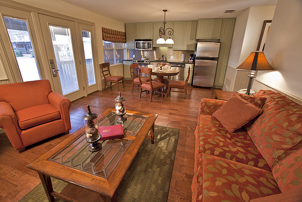
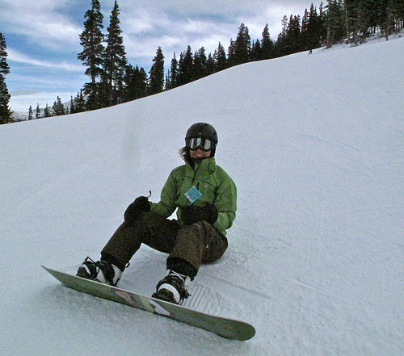
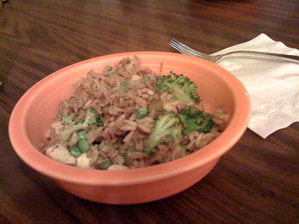

# Instructions

There is an image, a question about the image, and a list of possible answers. Please choose the best answer for the question.
Choose the most appropriate answer for the question.

**Guideline 1**: When asking "Is the X relation the Y", look at the Y object in first person, and determine the relation to X.  
**Guideline 2**: When asking on an object, refer to the most probable object.   
**Guideline 3**: If you don't see an object explicitly, it is not there.   

## Is the X relation Y

### Example 1:  
  
**Q1**: Is the refrigerator to the left of an oven?   
**A1**: No  
**E1**: If I am the oven (Y), the refrigerator (X) is **right** to me (not left) (**guideline 1**). 
  
**Q2**: Is the refrigerator to the left of a lamp?   
**A2**: Yes  
**E2**: First, we need to understand which lamp the question is referring to. There is the a table **lamp** on the right, and the ceiling **chandelier**. 
So this is referring to the **lamp** in the end of the sofa at the right side of the image (**guideline 2**).   
If so, the refrigerator is the the left of me (**guideline 1**).  

### Example 2:  
  
**Q1**: Is the tree behind an elephant?  
**A1**: No  
**E1**: We don't see elephant, so we answer no.

**Q2**: Is the tree behind a skier?  
**A2**: Yes  
**E2**: If I am the skier (Y), then the tree (X) is behind me (**guideline 1**). So the answer is yes. 

### Example 3:  
  
**Q1**: Is the animal in front of a laptop?  
**A1**: Yes
**E1**: If I am the laptop (Y), then the animal (X) is in front of me (**guideline 3**).

### Example 4:  
  
**Q1**: Is the grass behind of the bench?
**A1**: Yes
**E1**: If I am the bench (Y), the the grass (X) is behind me (**guideline 33**).

## Are there any X near the Y

### Example 5:   
  
**Q1**: Is there any lettuce near the metal utensil?  
**A1**: No  
**E1**: We don't see lettuce, so we answer no (**guideline 3**).

Q2: Is there any bowl near the metal utensil?  
A2: Yes  
E2: The bowl is the orange object (**guideline 2**). So the answer is yes. 

### Example 6:  
  
Q1: Are there any vehicles near the airport?  
A1: Yes
E1: We do see a red vehicle in the left side of the image. So the answer is yes (**guideline 2**). 

Q2: Is there a large tree near the airport?  
A2: No
E2: We may see some bushes or trees, but it is not explicit. So the answer is no (**guideline 3**). 
